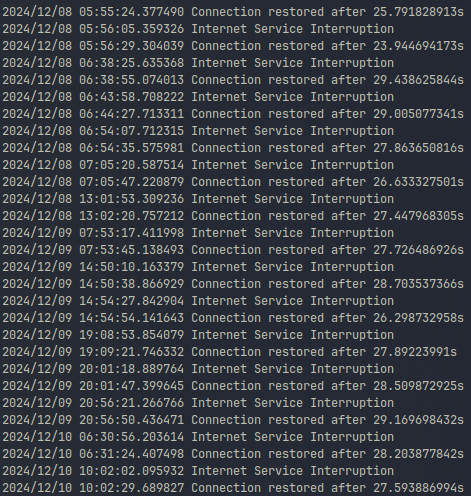

# LOS Logger

<p align="center">
  
</p>

---

My Personal logger for every time I lose internet connection.\
I needed something to show my ISP.

## Building and Running
The built binary is intended to be built with Docker and run as a daemon.

Build:
```sh
docker build -t los-logger:v<valid semantic version> .
```

Run:
```sh
docer run -d \
  -v /host/path/to/logs:/logs
  --env-file /path/to/.env
  --name los-logger
  los-logger:v<valid semantic version>
```

## Rust Rewrite
This project has been rewritten in Rust as of v2.0.\
To see the initial version made with Golang please see the [v1.1 branch](https://github.com/lborres/los_logger/tree/v1.1)
